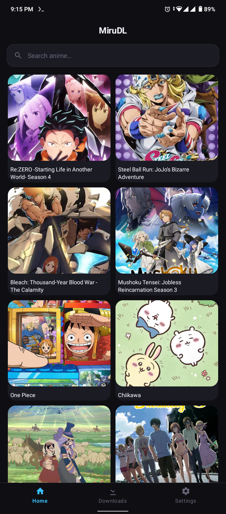
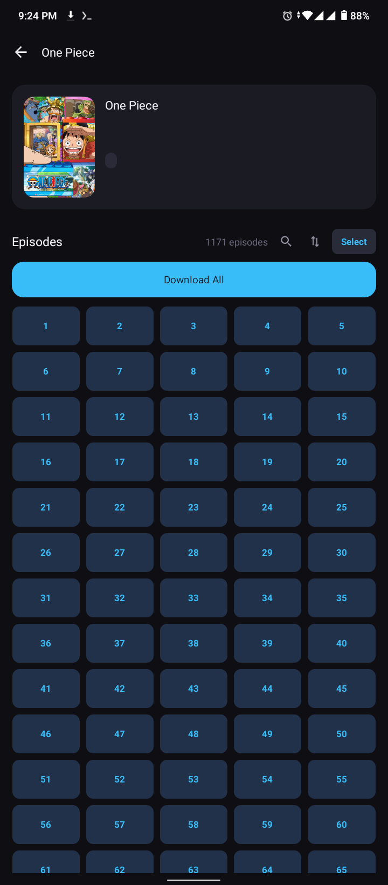
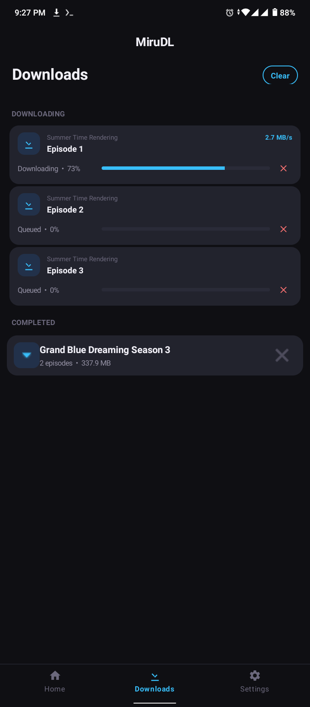
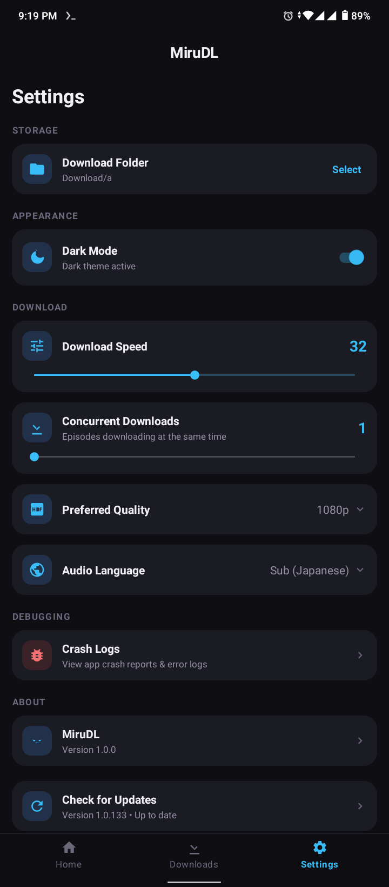

  

<h1 align="center">MiruDL (Coming Soon)</h1>

  <strong>A lightweight anime downloader for Android</strong>
   
  Browse, search, and download your favorite anime episodes directly to your phone.

  
  
  
  
  
   
  

---

## What is MiruDL?

**MiruDL** is a simple, fast, and free Android app for downloading anime episodes.

No ads. No accounts. No tracking. Just a clean way to get your favorite shows on your device.

---

## Features

| Feature | Description |
|---------|-------------|
| **Search** | Search thousands of anime titles instantly |
| **Episode list** | View all episodes with numbers |
| **Download** | Download any episode with one tap |
| **Download All** | Batch-download entire series at once |
| **Fast download** | High-speed download engine |
| **Quality select** | Auto / 360p / 480p / 720p / 1080p |
| **Multi-language** | Sub (Japanese) or Dub (English) audio |
| **Dark theme** | Built-in dark & light mode |
| **Custom folder** | Choose where to save downloads |
| **Download manager** | Track progress, pause, cancel, resume |
| **Download history** | View all completed downloads |
| **Material Design** | Clean, modern Android UI |

> Currently only one server is available. More servers will be added in the future.

---

## Screenshots

| Home | Detail | Downloads | Settings |
|------|--------|-----------|----------|
|  |  |  |  |

---

## How to Use

1. Open the app and type an anime name in the search bar.
2. Browse the results and tap on the anime you want.
3. View all available episodes and tap any episode to download.
4. Choose your preferred quality (Auto, 360p, 480p, 720p, or 1080p).
5. The download starts automatically. Track progress from the Downloads tab or notification bar.

---

## Download

  
   
  <b>Compatible with Android 5.0 (API 21) and above</b>

---

## App Settings

| Setting | Description |
|---------|-------------|
| **Download Folder** | Choose where videos are saved |
| **Download Speed** | Adjust download speed (Slow to Very Fast) |
| **Preferred Quality** | Default quality for all downloads |
| **Audio Language** | Sub (Japanese) or Dub (English) |
| **Dark Theme** | Toggle dark/light mode |

---

## Contributing

This app is currently **not open source** for contributions. We plan to make it open source in the future. When that happens, everyone will be welcome to contribute. Stay tuned!

---

## Developer

- **GitHub:** [@msrofficial](https://github.com/msrofficial)

---

  MiruDL -- Miru (見る) means "to watch" in Japanese. Download and watch anytime, anywhere.

